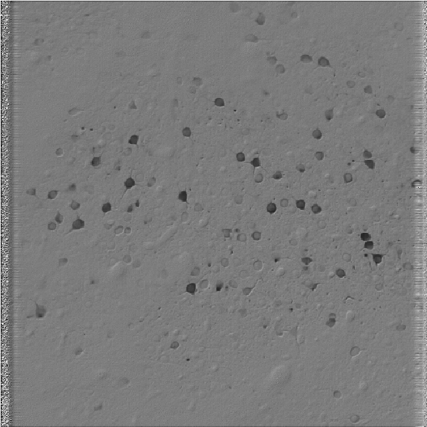
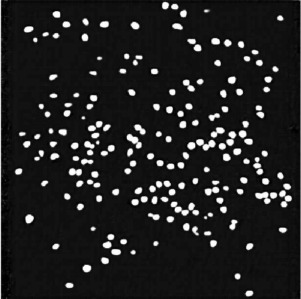
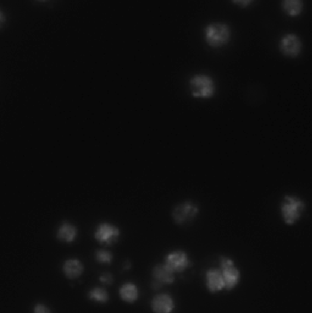
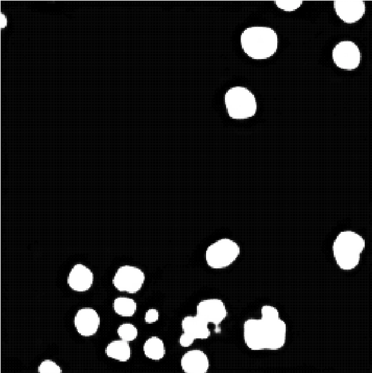

# Cell Segmentation

PyTorch implementation of several neural network segmentaion models (UNet, FusionNet, DialatedConvolution) for cell image segmentation. The trained models from this repository are used for the segmentation plugin [segmentify](https://github.com/transformify-plugins/segmentify) for [Napari](https://github.com/napari/napari)

| Original | Segmentation |
| --- | --- |
|  |  |

## Dataset

The following datasets were used to train and test the different cell segmentatoin models:

- [Nuclei Dataset](https://www.kaggle.com/c/data-science-bowl-2018/overview)

- [HPA Dataset](https://www.kaggle.com/c/human-protein-atlas-image-classification)

- [Nuero Dataset](http://neurofinder.codeneuro.org/)


## Process Data

After downloading the dataset from the links above, each dataset can be parsed and converted to a HDF5 file using scripts from *./process_data*. For example:

```python ./process_data/hpa_create_hdf5.py --input_dir PATH_TO_DATA --output_dir PATH_TO_OUTPUT```


## Segmentation Models:
This repository included several simple segmentation networks, including:

- [UNet](https://arxiv.org/abs/1505.04597)
- [FusionNet](https://arxiv.org/pdf/1612.05360.pdf)
- [Dialated Convolution](https://arxiv.org/abs/1511.07122)


## Training Modes
The same segmentation models can be trained for a wide range of tasks. These different training procedures are done by altering the output target for the training data, and implemented in the *./dataset* folder. 

### Simple Neuclei Segmentation

As expected, these segmentation models can be used for simple segmentation tasks such as segmenting out the Cell's nuclei:

| Dataset | Original | Segmentation |
| --- | --- | --- |
| Neuro | |  |
| Nuclei | |  |


### Cell Components Segmentation

The segmentation models cal also be used to simultaniously decompose microscopy images of cells into it's cellular structures, such as Nucleus, Microtubules and ER: 

| Original | ER | Nucleus | Microtubules | 
| --- | --- | --- | --- |
|  |  |  |  |

